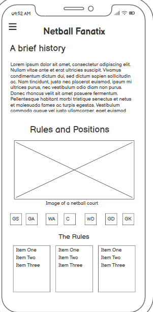
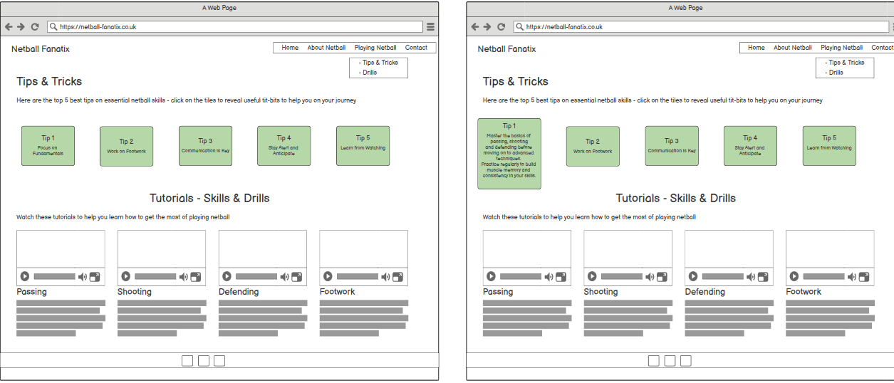
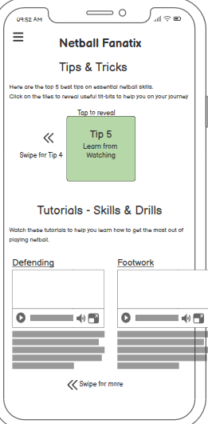

README.md

# Netball Fanatix
## Fanatic about netball

Welcome to Netball Fanatix! 
This is a static front-end website designed to teach people about the game of netball. 
The site provides useful and comprehensive education on netball rules, positions, skills and more to help users understand and enjoy the sport.

## Website URL

Visit the site at: [Netball Fanatix](https://yemsala.github.io/netball-fanatic/index.html)

## Table of Contents

- [Introduction](#introduction)
- [Pages](#pages)
- [Features](#features)
- [Technologies Used](#technologies-used)
- [Wireframes](#wireframes)
- [Colour palette](#colour-palette)
- [User Stories](#user-stories)
- [References](#references)
- [Contact](#contact)

## Introduction

Netball Fanatix is a resource for netball enthusiasts and beginners alike. 
The site aims to provide valuable information about the sport including its history, basic rules & positions and essential skills.
It also provides video resources to watch and learn and includes a link to the England netball website for users who want to engage further.

## Pages

The website consists of the following pages:

1. **Homepage**: Introduction to netball and the website, with a links to how to play resources.
2. **About Netball**: Detailed explanation of what netball is, its history and how the game is played.
3. **Netball Skills and Techniques**: Tips, advice and tutorials on essential netball skills such as passing, shooting, footwork and defending.
4. **FAQs / Contact Us**: Answers to frequently asked questions and a contact form for inquiries.

## Features

- Informative content on netball history, rules, positions and skills.
- Tooltip images to learn more about positions.
- Tip cards to reveal useful advice about how to play netball.
- Easy navigation with a main menu and structured layout.
- Contact form for user inquiries and feedback.
- Social media link for further engagement.

## Technologies Used

- **HTML5**: For structuring the content on the website.
- **CSS3**: For styling and layout.
- **Javascript**: For styling
- **Bootstrap**: For responsive design and additional styling components.
- **Git & GitHub Pages**: Used to securely store the code and to host and deploy the live project.
- **GitPod**: Used as a cloud-based IDE for development
- **Chrome Developer Tools**: Used for testing and troublshooting code, along with Lighthouse auditing
- **Balsamiq**: Used to create wireframes during project planning

## Wireframes

Wireframes were created using Balsamiq and used as a blueprint for development of the site layout and structure.

## Color Palette

The website uses a palette of colours based around the bespoke logo image. The colour palette was created using the Coolors website.

## User Stories

### User Goals
- To be able to view the site on a range of device sizes.
- To make it easy for potential netball enthusiasts to find out about the sport and how to get involved.
- To provide clear information about upcoming netball events and activities.
- To allow visitors to contact Netball Fanatix for further questions or feedback.

### First Time Visitor Goals
- I want to find out what Netball Fanatix is and how I can get involved in netball.
- I want to be able to navigate the site easily to find information about netball.
- I want to be able to find their social media profiles for more updates and engagement.

### Returning Visitor Goals
- I want to find up-to-date information on upcoming netball events and activities.
- I want to be able to easily contact Netball Fanatix with questions or feedback.

### Frequent Visitor Goals
- I want to be able to recommend drills, tutorials or tips for inclusion on the site.

## References

- Source: YouTube | Arjun Khara | [Link:https://youtu.be/OV8MVmtgmoY]
    - Used for inspiration for flip card code
- Source: Slack | Vernell C | [Link:https://github.com/VCGithubCode]
    - Fellow student who provided invaluable mentorship and support during each stage of the project and especially in debugging
- Source: W3Schools | [Link:https://www.w3schools.com/]
    - Used for HTML & CSS code 
- Source: Bootstrap | [Link:https://getbootstrap.com/]
    - Used for styling
- Source: Chat GPT [Link:https://chatgpt.com/]
    - For content & research
- Picture References
- Source: Cynon Netball Club | [Link:https://connectrct.org.uk/activity/cynon-back-to-netball-club]
- Source: Gilbert Netball | [Link:https://www.gilbert-netball.com/blogs/netball/netball-101]
- Source: Linked-In |The Pivot Newsletter | [https://www.linkedin.com/pulse/pivot-jacob-william-gooden/]
- Source: England Netball | [https://www.linkedin.com/pulse/pivot-jacob-william-gooden/]
- Source: Netball Australia |[https://netball.com.au/news/immense-sense-achievement-and-pride-teede-recalls-71-world-netball-tournament]
- Source: World Netball | [Link:https://netball.sport/game/facilities-and-equipment/]
- Source: Play Netball | [Link:https://www.play-netball.co.uk/rules-and-regulations/]
- Videos
- Source: intosport.com | [Link:https://www.youtube.com/watch?v=TvfGjq7cWfA]
- Source: Netball Australia| [Link:https://www.youtube.com/watch?v=N_kiYeeYvkU&t=12s]
- Source: Netball Australia| [Link:https://www.youtube.com/watch?v=lzPJPCg5SCg]
- Source: Netball Australia| [Link:https://www.youtube.com/watch?v=rtnDm52t_eM&list=PLgCNJssaP1-xN6wILskPThBNxXFrNX368&index=5] 

## Contact

For any inquiries or feedback, please contact us via the contact form on the website or reach out on our social media channels.

Thank you for visiting Netball Fanatix!

---
