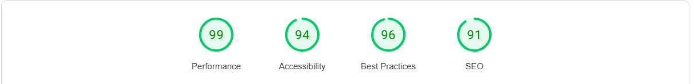

# Netball Fanatix
## Fanatic about netball

### Introduction

Welcome to Netball Fanatix! 
This is a static front-end website designed to teach people about the game of netball. 
The site provides useful and comprehensive education on netball rules, positions, skills and more to help users understand and enjoy the sport.

## Website 

Visit the site at: [Netball Fanatix](https://yemsala.github.io/netball-fanatic/index.html)

## Table of Contents

- [Project Goals](#project-goals)
- [Pages](#pages)
- [Features](#features)
- [User Experience](#user-experience)
    - [User Stories](#user-stories)
    - [Design](#design)
        - Color Scheme
        - Typography
        - Imagery
        - Wireframes
- [Technologies Used](#technologies-used)
- [Testing](#testing)
- [Deployment](#deployment)
- [Credits](#credits)
- [Contact](#contact)

## Project Goals

Netball Fanatix is a resource for netball enthusiasts and beginners alike. 
The site aims to provide valuable information about the sport including its history, basic rules & positions and essential skills.
It also provides video resources to watch and learn and includes a link to the England netball website for users who want to engage further.

## Pages

The website consists of the following pages:

1. **Homepage**: Introduction to netball and the website, with a links to how to play resources.
2. **About Netball**: Detailed explanation of what netball is, its history and how the game is played.
3. **Netball Skills and Techniques**: Tips, advice and tutorials on essential netball skills such as passing, shooting, footwork and defending.
4. **FAQs / Contact Us**: Answers to frequently asked questions and a contact form for inquiries.

## Features

### Existing Features

- A mobile-first, fully responsive site design accessible on all types of devices.
- Informative content on netball history, rules, positions and skills.
- Links to access other areas within the site as well as external sites.
- Tooltip images to learn more about positions.
- Tip cards to reveal useful advice about how to play netball.
- iframe YouTube videos to learn more on Tips & Skills page.
- Easy navigation with a main menu and structured layout.
- Contact page with contact form for user inquiries and feedback.
- Header & footer navigation used on all pages across the site.
- Navigation toggle button (hamburger) on narrow devices.
- Social media link for further engagement.

### Post MVP Features

- Events Section: A dedicated section or page where upcoming netball events and activities are listed.
- Regular Updates: Frequent updates on the homepage or a news section to inform visitors about the latest events and news related to netball.
- Calendar Integration: An integrated calendar or schedule displaying upcoming events, ensuring users can easily see what's next.
- Engagement Features: Interactive elements like comment sections or forums where frequent visitors can discuss and suggest new content.
- Community Involvement: Encouraging user-generated content and highlighting visitor contributions on the site, making frequent visitors feel their input is valued and implemented.

## User Experience

### User Stories

#### User Goals
- To be able to view the site on a range of device sizes.
- To make it easy for potential netball enthusiasts to find out about the sport and how to get involved.
- To provide clear information about upcoming netball events and activities.
- To allow visitors to contact Netball Fanatix for further questions or feedback.

#### First Time Visitor Goals
- I want to find out what Netball Fanatix is and how I can get involved in netball.
- I want to be able to navigate the site easily to find information about netball.
- I want to be able to find their social media profiles for more updates and engagement.

#### Returning Visitor Goals
- I want to find up-to-date information on upcoming netball events and activities.
- I want to be able to easily contact Netball Fanatix with questions or feedback.

#### Frequent Visitor Goals
- I want to be able to recommend drills, tutorials or tips for inclusion on the site.

### Design

##### Color Palette

The website uses a palette of colours based around the bespoke logo image to maintain a standard identity across all pages. The colour palette was created using the Coolors website.

##### Typography

The typography used on the Netball Fanatix site focuses on readability and a modern, clean aesthetic.

The Maitree font is used for title headings and navigation with sans-serif as a fall-back option should the chosen font fail to function properly. 
Quicksand & Roboto are used as the main fonts for the body content with serif as the fallback font should fthe chosen fonts not load correctly to the website. 

- Font Sizes

The font sizes are appropriately varied to create a clear visual hierarchy. Larger sizes are used for headings and titles, making them stand out and guide the user's attention. Body text is set at a comfortable reading size.

- Font Weights
 A mix of font weights is used to differentiate between various text elements. Bold weights are used for headings and important information, while regular weights are used for body text.

- Text Alignment

Text alignment is primarily left-aligned, which is the most readable format for English text. Center alignment is used sparingly for elements such as titles and form labels to create emphasis.

- Line Spacing and Letter Spacing
Generous line spacing and appropriate letter spacing ensure that the text is not cramped, improving overall legibility.

##### Imagery

The imagery on the Netball Fanatix site is carefully selected to enhance the user experience and visually represent the sport of netball. Key features include:

- High-Quality Images
The site uses high-resolution images to create a professional and engaging visual appeal.

- Relevant Visuals
Images depict netball players, candid shots from games and a court outline, aligning with the site's theme and content.

- Placement
Images are strategically placed to complement the text, breaking up content and making the site more visually appealing.

Overall, the imagery is designed to effectively support the site's purpose, engaging visitors and enhancing the overall look.

### Wireframes

Wireframes were created for each page in wide and narrow views, using Balsamiq. These were used as a guide for development of the site layout and structure.

- 
- 
- 
- 
- 
- 

## Technologies Used

### Languages Used

- **HTML5**: For structuring the content on the website.
- **CSS3**: For styling and layout.

### Frameworks, Libraries & Programs Used

- **Javascript**: Used to help with styling and responsiveness.
- [**Bootstrap 5**](https://getbootstrap.com/docs/5.3/getting-started/introduction/): For responsive design and additional styling components.
- [**Google Fonts**](https://fonts.google.com/): Google fonts was used to import the 'Maitree, Quicksand & Roboto' fonts into the style.css file.
- **Git & GitHub Pages**: Used for version control by utilizing the Gitpod terminal to commit to Git and Push to GitHub. Also to securely store the code and to host and deploy the live project.
- **GitPod**: Used as a cloud-based IDE for development
- **Chrome Developer Tools**: Used for testing and troublshooting code
- **Balsamiq**: Used to create wireframes during project planning

## Testing

### Testing User Stories

#### First Time Visitor Goals
- I want to find out what Netball Fanatix is and how I can get involved in netball.
    - Clear Mission Statement: The homepage and various sections highlight the purpose and goals of Netball Fanatix, making it clear what the site is about, particularly in the "What is Netball" section.

    

    - About Netball Page: Provides comprehensive information on netball, including its history and significance.

    

    - Playing Netball Page: Offers tips, drills and video tutorials, guiding visitors on how to get started and improve their skills.

    

- I want to be able to navigate the site easily to find information about netball.
    - Responsive Design: Ensures the site is accessible and easy to navigate on all device sizes.
    - Intuitive Menu: A well-structured navigation bar with clear labels and dropdowns, making it easy to find relevant sections.
    - Consistent Layout: Uniform design elements and page structures help users quickly locate information across different pages.

    

- I want to be able to find their social media profiles for more updates and engagement.
    - Footer Links: Social media icon with link to relevant site (e.g. England Netball) is prominently displayed in the footer.
    - Contact Page: Provides additional means to connect and follow updates via the form, ensuring visitors can engage further.

    

#### Returning Visitor Goals
- I want to find up-to-date information on upcoming netball events and activities.
    - Homepage: Users can easily navigate to the England Netball website via the footer link to find out about current events and activities in their local area.
- I want to be able to easily contact Netball Fanatix with questions or feedback.
    - Contact Page: A user-friendly contact form allowing visitors to submit their questions or feedback easily.

     

#### Frequent Visitor Goals
- I want to be able to recommend drills, tutorials or tips for inclusion on the site.
    - Contact Page: Users can use the feedback form to submit suggestions or recommendations for other tips, drills and tutorials
    - These goals would be further addressed with the planned post-MVP features such as Engagement Feature & Community Involvement.

### Overall Performance

#### Chrome DevTools Audit Report

The Google Page-speed Services were used to assess the accessibiity of the project to ensure the site met expected accessible standards on desktop and mobile.

 

### Browser Testing

- The site has been tested on Google Chrome, Safari, Microsoft Edge and Firefox browsers.
- The website was tested on my iPhone 13 mobile. All other responsive testing was completed online.
- Testing was done to ensure that all pages were linking correctly and external links opened in a new tab.
- Friends and family members reviewed the site and documentation to point out any bugs and/or user experience issues.

#### Performance By Page

| Page        | Result           | Notes  |
| ------------- |:-------------:| -----:|
| Home |    |   Reasonably good performance with areas for improvement   |
| About Netball      |     |  Some areas for improvement but good overall  |
| Playing Netball |      |  More work is needed to improve performance   |
| Contact |       |  This is the best performing page with 100% accessibility   |

### Code Validation

Each page of the project was thoroughly checked for syntax errors using the W3C Markup Validator and W3C CSS Validator Services. The validation results and corresponding screenshots are presented in the table below.

|  Page        | Result           | Notes  |
| ------------- |:-------------:| -----:|
| Home |   |  No errors |
| About Netball |     | No errors   |
| Playing Netball |    |  No errors  |
| Contact |    | No errors  |
| CSS |    | Passed (initial parsing error resolved)  |

### Bug fixes

1. I had a lot of issues with my initial workspace being set up on Gitpod, which I was unable to resolve. I ended up swithcing to VS-Code Desktop as an IDE and started working locally so I could continue with my project development.
However, I was later able to create a new Gitpod workspace and link it with my project on VS-Code but that came with a new set of problems because I ended up working on 2 separate branches and some changes were not being pushed to the main.
I did a lot of work to merge the work in both branches and continue working in one space eventually.

2. On the 'About Netball' page, the bib positions column was overlapping the 'rules' column in mobile view. So I did some work to hide both columns in mobile view to ensure the layout of the page remained clean - see screenshot 

| Desktop       | Mobile           |
| ------------- |:-------------:|
|      |   |

3. On initial validation of my CSS code, I kept getting a parsing error for line 367, where I had an element nested inside another for the videos on the Playing Netball page and the validator didn't like that and therefore kept throwing up this error. 
To solve this issue, I removed, the *.col-3* element out of the *.tutorial-videos* element and although I was worried it might affect the output, it didn't. After doing this, I was able to pass the CSS code validation (see relevent screenshot in the *Code Validation* section above).

## Deployment

### Github Pages

1. Access Your GitHub Repository
    - Log into GitHub and navigate to the repository you're working with.
    
2. Find the "Settings" Option
    - Within your repository's page (not the top of the GitHub site), find and click the "Settings" button in the menu bar.

3. Navigate to GitHub Pages Settings
    - On the Settings page, scroll down until you find the "GitHub Pages" section.

4. Select the Source for Your Site
    - In the "Source" section, use the dropdown menu (initially set to "None") and select "Main Branch" (or "Master Branch" if that's what your repository uses).

5. Wait for Page Refresh
    - The page will refresh automatically after you select the branch.

6. Scroll back down through the page to locate the now published site [link](https://yemsala.github.io/netball-fanatic/index.html)  in the "GitHub Pages" section.

### Forking the GitHub Reository

By forking the GitHub Repository we make a copy of the original repository on our GitHub account to view and/or make changes without affecting the original repository by using the following steps...

1. Log in to GitHub and locate the [GitHub Repository](https://github.com)
2. At the top of the Repository (not top of page) just above the "Settings" Button on the menu, locate the "Fork" Button.
You should now have a copy of the original repository in your GitHub account.

### Making a Local Clone

1. Log in to GitHub and locate the [GitHub Repository](https://github.com)
2. Under the repository name, click "Clone or download".
3. To clone the repository using HTTPS, under "Clone with HTTPS", copy the link.
4. Open Git Bash
5. Change the current working directory to the location where you want the cloned directory to be made.
6. Type git clone, and then paste the URL you copied in Step 3.

$ git clone https://github.com/YemsAla/netball-fanatic.git

7. Press Enter. Your local clone will be created.

$ git clone https://github.com/YemsAla/netball-fanatic.git

> Cloning into `CI-Clone`...
> remote: Counting objects: 10, done.
> remote: Compressing objects: 100% (8/8), done.
> remove: Total 10 (delta 1), reused 10 (delta 1)
> Unpacking objects: 100% (10/10), done.

Click [Here](https://docs.github.com/en/repositories/creating-and-managing-repositories/cloning-a-repository#cloning-a-repository-to-github-desktop) to retrieve pictures for some of the buttons and more detailed explanations of the above process.

## Credits

### Acknowledgements

- Cohort Leader Rachel Furlong for her continued support.
- Tutor support at Code Institute for their support.
- Vernell C | [https://github.com/VCGithubCode]
    - Fellow student who provided invaluable mentorship and support during each stage of the project, especially in debugging.

### References

- Source: YouTube | Arjun Khara | [https://youtu.be/OV8MVmtgmoY]
    - Used for inspiration for flip card code
- Source: W3Schools | [https://www.w3schools.com/]
    - Used for HTML & CSS code 
- Source: Chat GPT [https://chatgpt.com/]
    - For content & research
- Picture References
    - Source: Cynon Netball Club | [https://connectrct.org.uk/activity/cynon-back-to-netball-club]
    - Source: Gilbert Netball | [https://www.gilbert-netball.com/blogs/netball/netball-101]
    - Source: Linked-In |The Pivot Newsletter | [https://www.linkedin.com/pulse/pivot-jacob-william-gooden/]
    - Source: England Netball | [https://www.linkedin.com/pulse/pivot-jacob-william-gooden/]
    - Source: Netball Australia |[https://netball.com.au/news/immense-sense-achievement-and-pride-teede-recalls-71-world-netball-tournament]
    - Source: World Netball | [https://netball.sport/game/facilities-and-equipment/]
    - Source: Play Netball | [https://www.play-netball.co.uk/rules-and-regulations/]
- Videos
    - Source: intosport.com | [https://www.youtube.com/watch?v=TvfGjq7cWfA]
    - Source: Netball Australia| [https://www.youtube.com/watch?v=N_kiYeeYvkU&t=12s]
    - Source: Netball Australia| [https://www.youtube.com/watch?v=lzPJPCg5SCg]
    - Source: Netball Australia| [https://www.youtube.com/watch?v=rtnDm52t_eM&list=PLgCNJssaP1-xN6wILskPThBNxXFrNX368&index=5] 

## Contact

For any inquiries or feedback, please contact us via the contact form on the website or reach out on our social media channels.

Thank you for visiting Netball Fanatix!

---

